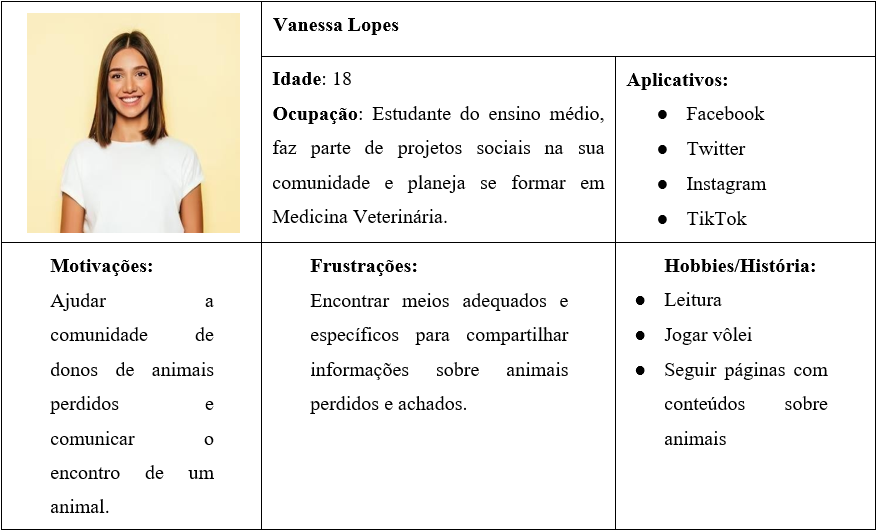
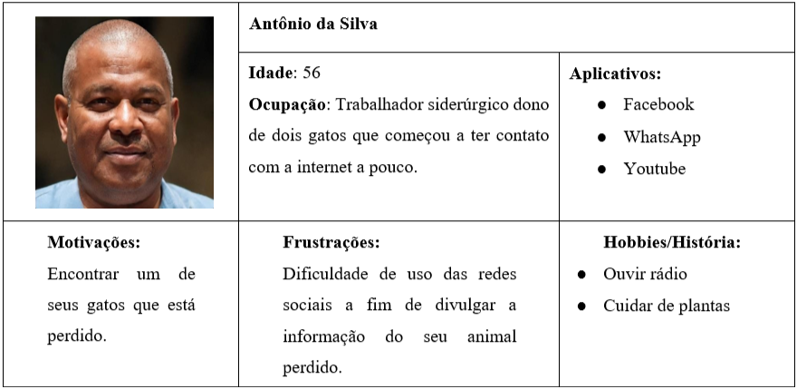

# Especificações do Projeto

## Personas

## Histórias de Usuários

Com base na análise das personas foram identificadas as seguintes histórias de usuários:

|EU COMO... `PERSONA`| QUERO/PRECISO ... `FUNCIONALIDADE` |PARA ... `MOTIVO/VALOR`                 |
|--------------------|------------------------------------|----------------------------------------|
|Um amante de animais (Vanessa) | Ter contato com uma comunidade dedicada a encontrar animais | Ajudar a compartilhar as informações para encontra-los  |
|Dono de um animal perdido (Antonio) | Ter um local para divulgar o desaparecimento do meu animal | Espalhar a informação e encontra-lo |
|Uma pessoa que encontrou um animal (Vanessa) | Compartilhar informações sobre o animal encontrado |Encontrar o dono do mesmo |

## Requisitos

As tabelas que se seguem apresentam os requisitos funcionais e não funcionais que detalham o escopo do projeto.

### Requisitos Funcionais

|ID    | Descrição do Requisito  | Prioridade |
|------|-----------------------------------------|----|
|RF-01| O portal deve permitir que um usuário crie um post. | ALTA | 
|RF-02| O portal deve permitir que um usuário visualize e comente os posts.  | ALTA |
|RF-03| O portal deve permitir que um usuário filtre posts. | MÉDIA |
|RF-04| O portal deve permitir que um usuário compartilhe o post em outras redes sociais.  | MÉDIA |
|RF-05| O portal deve permitir que um usuário que criou o post o exclua.  | ALTA |
|RF-06| O portal deve permitir o login de um usuário. | ALTA |
|RF-07| O portal deve apresentar uma página contendo os animais encontrados. | BAIXA |
|RF-08| O portal deve apresentar um alerta em posts de animais que já foram encontrados.  | ALTA |
|RF-09| O portal deve apresentar uma sessão de comentários em cada post.  | MÉDIA |

### Requisitos não Funcionais

|ID     | Descrição do Requisito  |Prioridade |
|-------|-------------------------|----|
|RNF-01| O portal deverá ser responsivo permitindo a visualização em celular de forma adequada | ALTA | 
|RNF-02| O sistema deve atender à norma LGPD. |  ALTA | 

## Restrições

A fim de direcionar a forma de construção da solução Busca Pet, as seguintes restrições arquiteturais devem ser satisfeitas:

|ID| Restrição                                             |
|--|-------------------------------------------------------|
|01|O armazenamento de dados deverá ser realizado através do Local Storage |
|02| A aplicação deverá ser apresentada enquanto um sistema Web. |

