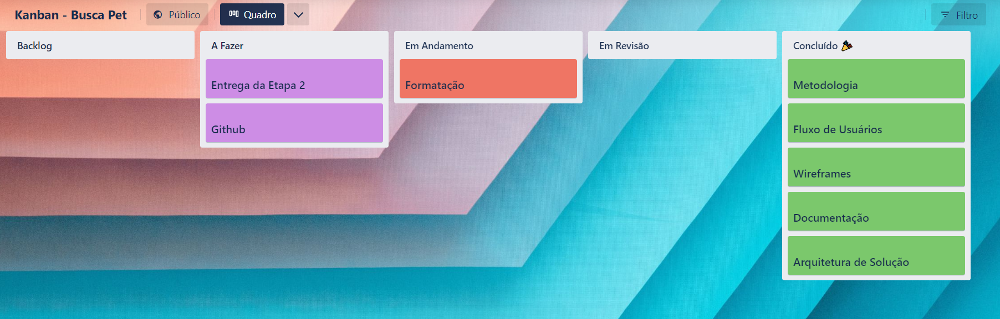

# Metodologia

A seguinte metodologia e maneira de trabalho em equipe foi definida:

## Ambientes de Trabalho

O projeto será desenvolvido a partir de plataformas de organização e gerenciamentos conforme a tabela abaixo:

|Artefato | Plataforma | Acesso |
|------|-----------------------------------------|----|
|Código fonte| Github | [Github](https://github.com/ICEI-PUC-Minas-PMV-ADS/pmv-ads-2023-1-e1-proj-web-t10-pmv-ads-2023-1-e1-proj-web-t10-buscapet) | 
|Prototipação interface| Figma | [Figma](https://www.figma.com/proto/iy7py7SRuxA7bbgTIuer5Y/Busca-Pet?node-id=1-4&scaling=min-zoom&page-id=0%3A1&starting-point-node-id=1%3A4) | 
|Acompanhamento do projeto| Trello | [Trello](https://trello.com/b/xDFMHB9L) | 

## Gerenciamento de Projeto

A equipe utilizará metodologias ágeis, tendo escolhido o Scrum como base para definição do processo de desenvolvimento.

A equipe está organizada da seguinte maneira:

- **Scrum Master:** Pedro Henrique Argentino Dias
- **Product Owner:** Harttur Luiz Junio Diogenes da Silva
- **Equipe de Desenvolvimento:** Marconi Magalhaes Santos do Carmo; Giovanna Lima Torres Guasch
- **Equipe de Design:** Ana Beatriz de Almeida Bacelar; Lucas Henrique Vasconcelos Siqueira

Para melhor organização está sendo utilizado o [Trello](https://trello.com/b/xDFMHB9L) com as seguintes listas:

- **Backlog:** Todos os artefatos da solução que serão quebrados em tarefas etapas.
- **A Fazer:** Tarefas da etapa em desenvolvimento que precisam ser feitas e ainda não foram atribuídas a nenhum membro.
- **Em Andamento:** Todas as tarefas da etapa que estão sendo feitas por algum dos membros.
- **Em Revisão:** Tarefa que está sendo revisada por outro membro.
- **Concluído:** Todas as tarefas que foram concluídas.

