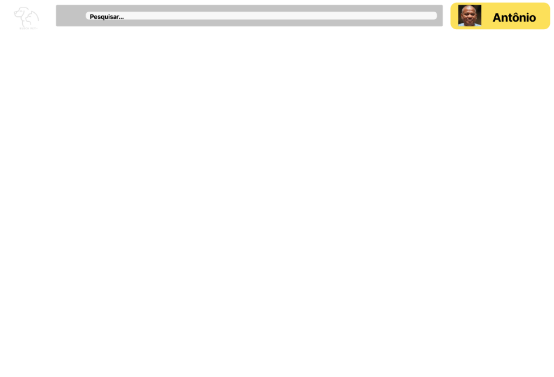
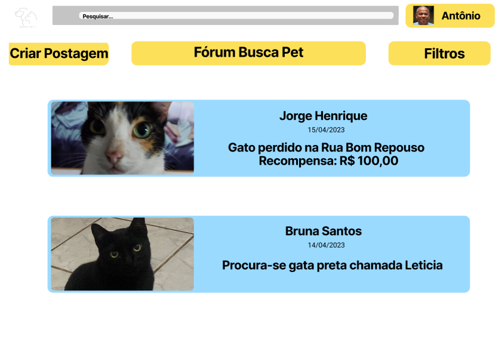
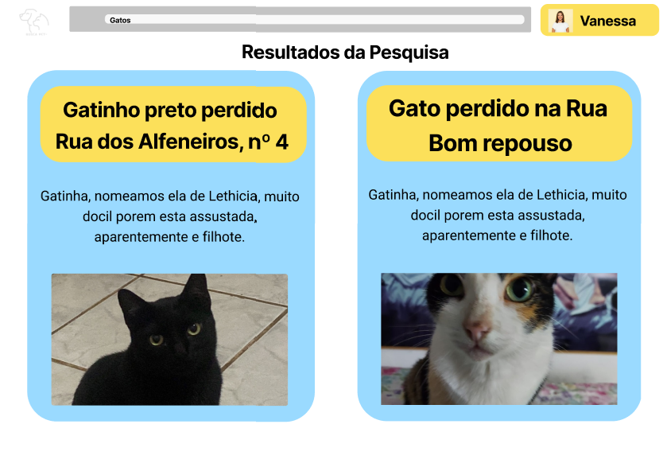

# Projeto de Interface

Em nossos processos determinamos o preparo da plataforma do sistema como critério de maior foco, visando melhor atender nossos usuários. Visto que não temos uma faixa etária de usuários definida, a interface foi construída pensando em ser simples, funcional e acessível, mas ainda bela e tecnológica. 

## User Flow

O fluxograma abaixo representa a forma de interação do nosso usuário com o portal, por quais telas percorrerá e sua comunicação. A visualização pode ser feita através do [Figma](https://www.figma.com/proto/iy7py7SRuxA7bbgTIuer5Y/Busca-Pet?node-id=1-4&scaling=min-zoom&page-id=0%3A1&starting-point-node-id=1%3A4).

## Wireframes

Com a fluidez entre as telas no portal apresentado acima, nossas telas são mostradas com poucos detalhes para não confundir o usuário nem dificultar a experiencia em nosso portal. As telas do sistema são equipadas com as ferramentas de informação, de pesquisa, botão home e área do usuário.

- **Pesquisa:** A barra de pesquisa que auxilia os utilizadores a buscarem postagens com mais agilidade e por filtros específicos.
- **Botão home:** Botão que retorna a tela inicial do sistema.
- **Perfil do usuário:** Botão que apresenta o usuário que está logado.

### Tela - Login

Tela secundária do sistema, onde o usuário realiza a autenticação em nosso portal podendo assim fazer parte da comunidade e escrever posts.

### Tela - Homepage

Tela inicial do portal, onde é mostrado as últimas postagens de animais encontrados e perdidos. Nela pode acontecer a primeira interação entre os usuários. Pode também nesta tela, realizar a busca por uma postagem especifica de sua escolha, através da barra de pesquisa.

### Tela - Fórum

Tela padrão do fórum, permitindo a criação e visualização de postagens.

### Resultados de Pesquisa

Na tela de resultados de pesquisa, os usuários que optarem por utilizar a barra de pesquisa irão ser direcionado a posts com base nas palavras chaves ou filtros utilizados.

### Postagem

A tela de postagem exibe uma postagem completa com todas as informações detalhadas.

### Comentários

Componente da tela de postagem, na parte de comentários nossos usuários podem realizar as interações necessárias com os demais integrantes da comunidade.

### Criar Postagem

Tela que permite que um usuário escreva uma postagem.

