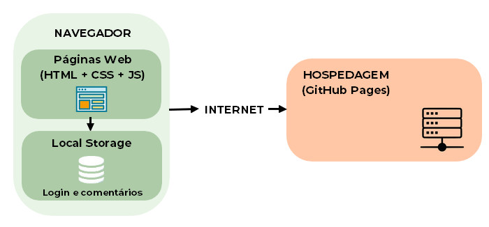

# Arquitetura da Solução

Nesta seção são apresentados os detalhes técnicos da solução criada pela equipe, tratando dos componentes que fazem parte da solução e do ambiente de hospedagem da solução.

## Diagrama de componentes

Os componentes que fazem parte da solução são apresentados na figura que se segue.

A solução implementada conta com os seguintes módulos:

- **Navegador** - Interface básica do sistema  
  - **Páginas Web** - Conjunto de arquivos HTML, CSS, JavaScript e imagens que implementam as funcionalidades do sistema.
   - **Local Storage** - Armazenamento dos comentários e login do usuário.
- **Hospedagem** - local na Internet onde as páginas são mantidas e acessadas pelo navegador. 

## Hospedagem

O Busca Pet utiliza a plataforma do GitHub Pages como ambiente de hospedagem do projeto. 
