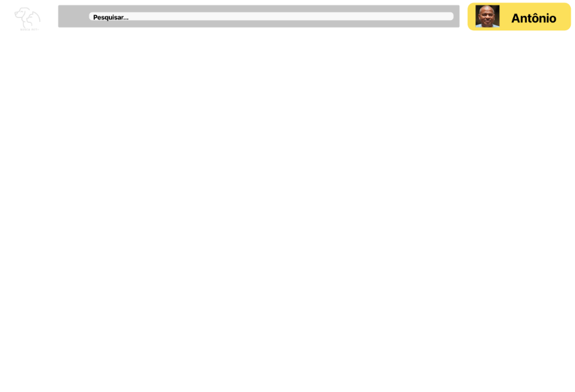

# Template padrão do site

O padrão de layout a ser utilizado pelo site tem correspondência ao projeto de Interface elaborado anteriormente.

A logo, barra de pesquisa e local de usuário deve estar em todos os layouts.
O código da mesma está na pasta src.