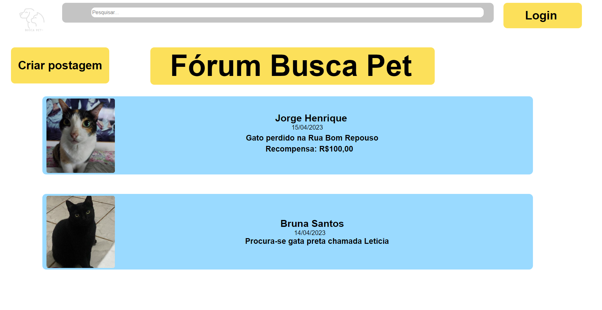
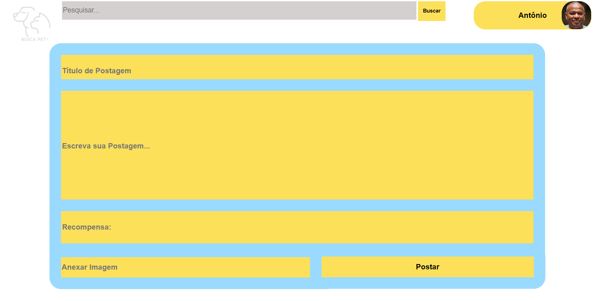
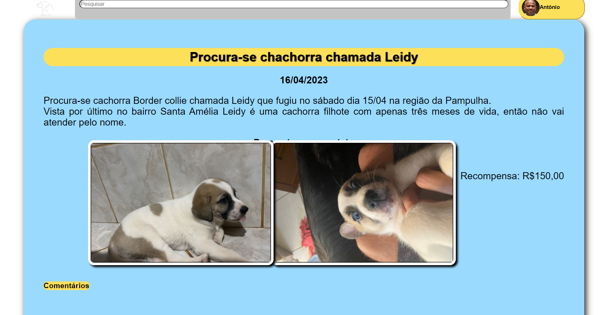
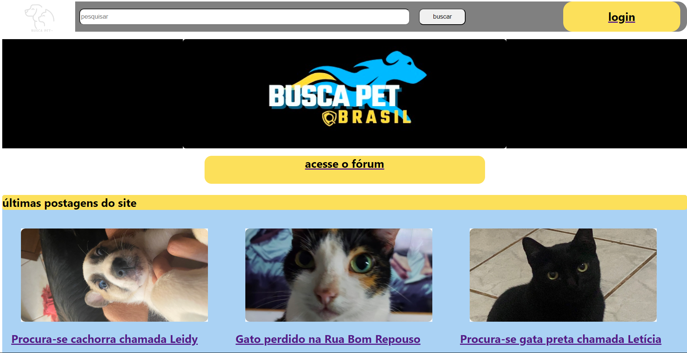

# Programação de Funcionalidades

Nesta seção são apresentadas as telas desenvolvidas para cada uma das funcionalidadesdo sistema. As orientações de acesso são apresentadas na sequência.

## Tela do Fórum (RF-01 e RF-03)

A tela principal do Fórum permite a criação e filtragem de posts.

**Artefatos de funcionalidade**
- Pasta com Imagens
- index.html
- style.css

**Instruções de acesso**
1. Faça o download do arquivo do projeto (ZIP) ou clone do projeto no GitHub;
2. Descompacte o arquivo em uma pasta específica;
3. Abra o Visual Studio Code e execute o Live Server;

## Tela de Login (RF-06)

A tela de login pernite que o usuário acesse seu próprio perfil.

**Artefatos de funcionalidade**
- Login.html
- logo.png
- style.css

**Instruções de acesso**
1. Faça o download do arquivo do projeto (ZIP) ou clone do projeto no GitHub;
2. Descompacte o arquivo em uma pasta específica;
3. Abra o Visual Studio Code e execute o Live Server;

## Comentários (RF-02 e RF-09)

Tela que mostra todos os comentários de uma postagem.

**Artefatos de funcionalidade**
- Imagens
- coments.html
- style.css

**Instruções de acesso**
1. Faça o download do arquivo do projeto (ZIP) ou clone do projeto no GitHub;
2. Descompacte o arquivo em uma pasta específica;
3. Abra o Visual Studio Code e execute o Live Server;

## Criar postagem (RF-01)

Tela que permite a criação de uma postagem.

**Artefatos de funcionalidade**
- index.html
- image.png

**Instruções de acesso**
1. Faça o download do arquivo do projeto (ZIP) ou clone do projeto no GitHub;
2. Descompacte o arquivo em uma pasta específica;
3. Abra o Visual Studio Code e execute o Live Server;

## Postagem (RF-02 e RF-04)

Tela que permite a visualização de uma postagem.

**Artefatos de funcionalidade**
- index.html
- cachorro1.png
- cachorro2.png
- logotipo.png
- logotipopng.png
- style.css
- stylesearch.css

**Instruções de acesso**
1. Faça o download do arquivo do projeto (ZIP) ou clone do projeto no GitHub;
2. Descompacte o arquivo em uma pasta específica;
3. Abra o Visual Studio Code e execute o Live Server;

## Tela Inicial

Tela inicial do fórum que permite a entrada.

**Artefatos de funcionalidade**
- capa.png
- gatinha.png
- leidy.png
- leticia.png
- logo.png
- index.html
- style.css

**Instruções de acesso**
1. Faça o download do arquivo do projeto (ZIP) ou clone do projeto no GitHub;
2. Descompacte o arquivo em uma pasta específica;
3. Abra o Visual Studio Code e execute o Live Server;