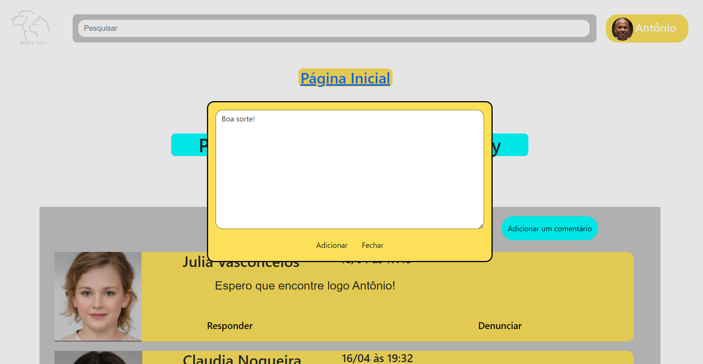
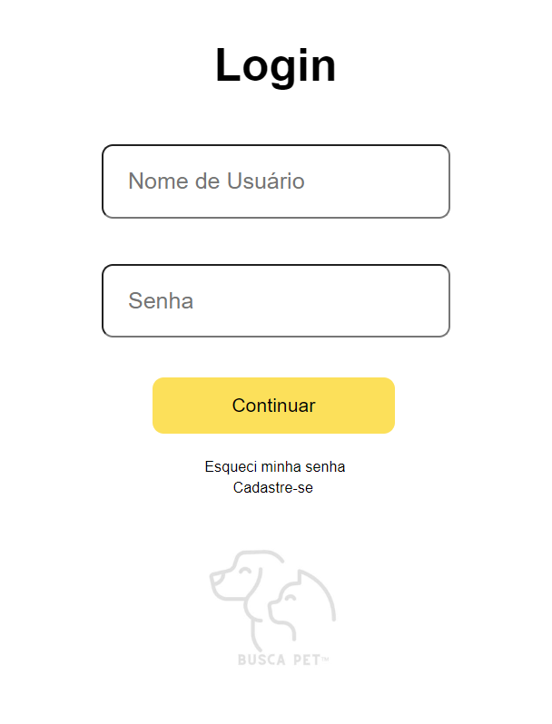
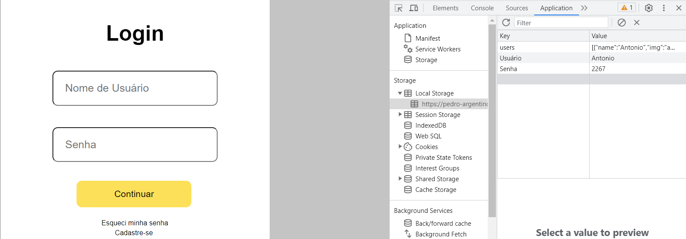

# Registro de Testes de Software

Relatório com as evidências dos testes de software realizados no sistema pela equipe, baseado em um plano de testes pré-definido.

## Criação de Comentários - Harttur

O usuário consegue comentar com sucesso nas postagens.

## Armazenamento de Login - Pedro

O usuário consegue deixar seus dados armazenados dentro do site.

## Avaliação

Todos os testes foram um sucesso, mas podem ser aperfeiçoados em questão visual.
